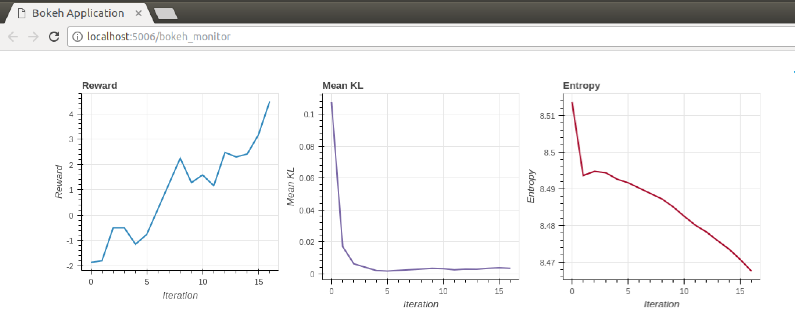

# Pytorch RL

This is a small, modular library that contains some implementations of continuous reinforcement learning algorithms. Fully compatible with OpenAI gym.


## Running experiments

### Basics
An example of running an experiment using vanilla policy gradient is shown in ```examples/vpg.py```.


### Logging
For the logger to work properly, you want to supply all of your hyperparameters via command line arguments through argparser, and pass the resulting object to an instance of ```rl.utils.Logger```. Beyond your algorithm hyperparameters, the Logger expects that you supply an argument named ```logdir```, containing the root directory you want to store your logfiles in, and an argument named ```seed```, which is used to seed the pseudorandom number generators.

An basic command line script illustrating this is:
```bash
python examples/vpg.py --logdir experiments/ --seed l337
```

The resulting
```
experiments/
└── e2374a18f0
    ├── experiment.info
    └── seed1.log
```
## Monitoring live training progress

### With bokeh
To manually monitor training progress in a browser using bokeh, run the following command, giving it the path to the active log file.
```bash
bokeh serve --show bokeh_monitor.py --args path/to/file.log
```
This should open a tab to http://localhost:5006/bokeh_monitor in your browser. If all goes well, you should see something like this image:



### With matplotlib

Comming soon.


## Soon to be implemented:

* PPO
* A3C
* Parallelism
* Beta distribution policy

Bells and whistles:
* GAE and TD(lambda) estimators
* Variable step size for VPG (aka poor man's natural gradient)
* Entropy based exploration bonus
* Observation and advantage centering
* Pytorch wrapper for OpenAI Gym environments

To be implemented long term:

* DDPG
* NAF
* SVG
* I2A
* PGPE?
* Noisy Nets for Exploration
* CUDA support (should be trivial but I don't have a GPU to test on currently)

Maybe implemented in future:

* TRPO
* DXNN
* ACER and other off-policy methods
* Model-based methods

In the pipeline:
* ~Visdom~ Bokeh for progress tracking
* Package everything

Implemented:
* VPG plus + baseline confirmed to be correct and fast.
* No baseline implementation to test against, but adaptive VPG appears correct.
